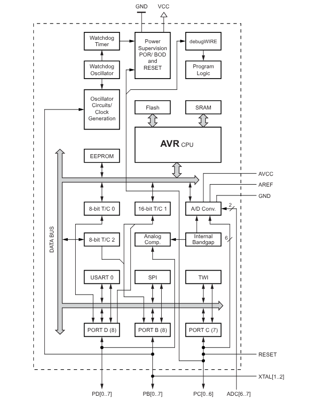
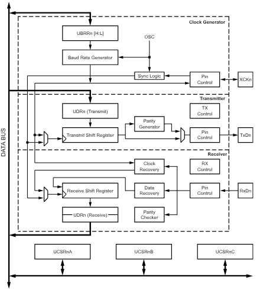
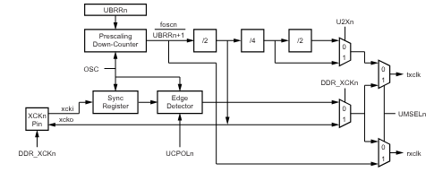
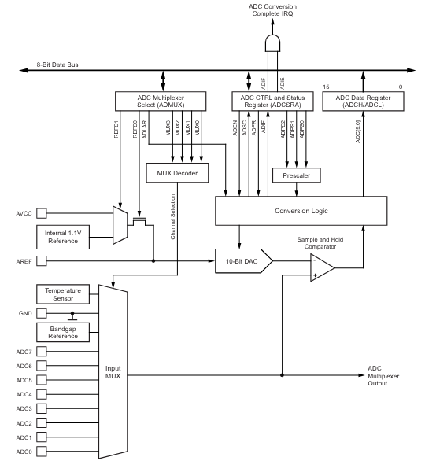
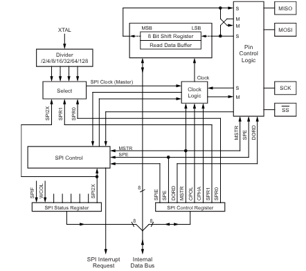
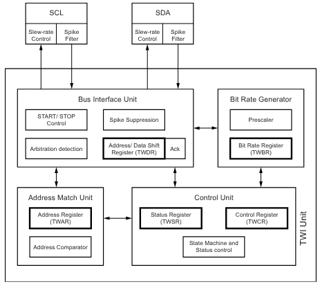
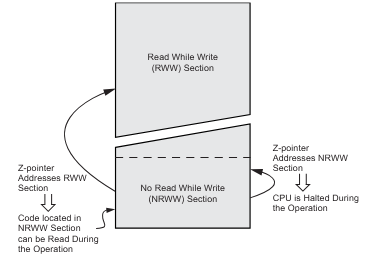
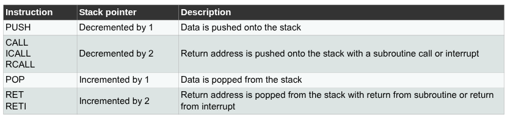
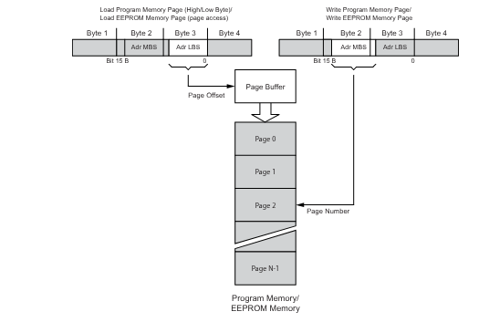
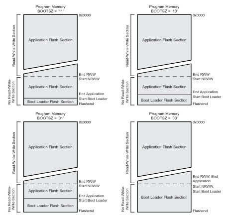

# THE MC IS : ATMEGA328P

## Functional caracteristics

AVR Core : AVRe+ 
Missing instructions: ELPM, EIJMP, EICALL

32 8Bit registers
32Kbytes of self-programmable flash
1Kbytes of EEPROM
2Kbytes internal SRAM 

Program Counter : 15bits 

### Block Diagram of the AVR Architecture:

### Peripherals

#### GPIO

#### Timer/Counters

#### UART

#### Basic ADC

#### SPI

#### I2C

#### 8-bit Timer/Counter0 with PWM

#### 8-bit Timer/Counter2 with PWM

#### 16-bit Timer/Counter1 wiht PWM

#### Interrupt handling

#### ROM loader for .hex files

#### TWI 

### Memory

#### Program Memory 

#### Data Memory 

#### Pointer registers
- R26 X-register Low Byte 
- R27 X-register High Byte
- R28 Y-register Low Byte
- R29 Y-register High Byte
- R30 Z-register Low Byte 
- R31 Z-register High Byte 

#### Memory Map

There are "Read-While-Write" and "No Read-While-Write Flash Section" in the flash memory:

if there are 2 adresses such as 0x3F (0x5F):
0x3F address is to be used by instructions such as "IN" and "OUT"
0x5F address is to be used by instructions such as "LD" "LDS" "ST" "STS"

0x00 to 0x1F General Purpose Working Registers

##### UART
- 0xC6 UDR0
- 0xC5 UBRR0H
- 0xC2 UCSR0C
- 0xC1 UCSR0B
- 0xC0 UCSR0A

##### 2-wire Serial Interface
- 0xBD TWAMR
- 0xBC TWCR
- 0xBB TWDR
- 0xBA TWAR
- 0xB9 TWSR
- 0xB8 TWBR

##### Timer/Counter2 

- 0xB6 ASSR
- 0xB4 OCR2B
- 0xB3 OCR2A
- 0xB2 TCNT2
- 0xB1 TCCR2B
- 0xB0 TCCR2A 

Interrupts:
- 0x70 TIMSK2
- 0x17 (0x37) TIFR2 – Timer/Counter2 Interrupt Flag Register

##### Timer/Counter1

- 0x8B OCR1BH
- 0x8A OCR1BL
- 0x89 OCR1AH
- 0x88 OCR1AL
- 0x87 ICR1H
- 0x86 ICR1L
- 0x85 TCNT1H
- 0x84 TCNT1L

- 0x82 TCCR1C
- 0x81 TCCR1B
- 0x80 TCCR1A

Interrupts:
- 0x6C TIMSK1
- 0x16 (0x36) TIFR1 – Timer/Counter1 Interrupt Flag Register
- 0x15 (0x35) TIFR0 – Timer/Counter 0 Interrupt Flag Register

##### Timer/Counter0
Interrupts:
- 0x6E TIMSK0

- 0x28 (0x48) OCR0B – Output Compare Register B
- 0x27 (0x47) OCR0A – Output Compare Register A
- 0x26 (0x46) TCNT0 – Timer/Counter Register
- 0x25 (0x45) TCCR0B – Timer/Counter Control Register B
- 0x24 (0x44) TCCR0A – Timer/Counter Control Register A
- 0x23 (0x43) GTCCR – General Timer/Counter Control Register

##### Analog/ADC
Comparator:
- 0x7F DIDR1
- 0x30 (0x50) ACSR – Analog Comparator Control and Status Register

ADC:
- 0x7E DIDR0
- 0x7C ADMUX
- 0x7B ADCSRB
- 0x7A ADCSRA
- 0x79 ADCH
- 0x78 ADCL

##### GPIO

- 0x2B (0x4B) GPIOR2 – General Purpose I/O Register 2
- 0x2A (0x4A) GPIOR1 – General Purpose I/O Register 1
- 0x1E (0x3E) GPIOR0 – General Purpose I/O Register 0

Interrupts:
0x6D PCMSK2
0x6C PCMSK1
0x6B PCMSK0
0x69 EICRA 
0x68 PCICR
0x1D (0x3D) EIMSK – External Interrupt Mask Register
0x1C (0x3C) EIFR – External Interrupt Flag Register
0x1B (0x3B) PCIFR – Pin Change Interrupt Flag Register

D:
0x0B (0x2B) PORTD – The Port D Data Register
0x0A (0x2A) DDRD – The Port D Data Direction Register
0x09 (0x29)  PIND – The Port D Input Pins Address

C:
0x08 (0x28) PORTC – The Port C Data Register
0x07 (0x27) DDRC – The Port C Data Direction Register
0x06 (0x26) PINC – The Port C Input Pins Address

B:
0x05 (0x25) PORTB – The Port B Data Register
0x04 (0x24) DDRB – The Port B Data Direction Register
0x03 (0x23) PINB – The Port B Input Pins Address

##### General Control 

0x66 OSCCAL
0x64 PRR
0x61 CLKPR
0x3F (0x5F) SREG - AVR Status Register

0x3E (0x5E) SPH - Stack Pointer High
0x3D (0x5D) SPL - Stack Pointer Low Register

0x37 (0x57) SPMCSR -  Store Program Memory Control and Status Register
0x35 (0x55) MCUCR – MCU Control Register
0x34 (0x54) MCUSR – MCU Status Register
0x33 (0x53) SMCR – Sleep Mode Control Register

##### EEPROM
0x22 (0x42) EEARH - EEPROM address register high byte
0x21 (0x41) EEARL - EEPROM address register low byte
0x20 (0x40) EEDR – The EEPROM Data Register
0x1F (0x3F) EECR – The EEPROM Control Register

##### Watch dog
0x60 WDTCSR -  Watchdog Timer Control Register

##### SPI

0x2E (0x4E) SPDR – SPI Data Register
0x2D (0x4D) SPSR – SPI Status Register
0x2C (0x4C) SPCR – SPI Control Register

##### Reserved
(0xFF) (0xFE) (0xFD) (0xFC) (0xFB) (0xFA)
(0xF9) (0xF8) (0xF7) (0xF6) (0xF5) (0xF4)
(0xF3) (0xF2) (0xF1) (0xF0) (0xEF) (0xEE)
(0xED) (0xEC) (0xEB) (0xEA) (0xE9) (0xE8)
(0xE7) (0xE6) (0xE5) (0xE4) (0xE3) (0xE2)
(0xE1) (0xE0) (0xDF) (0xDE) (0xDD) (0xDC)
(0xDB) (0xDA) (0xD9) (0xD8) (0xD7) (0xD6)
(0xD5) (0xD4) (0xD3) (0xD2) (0xD1) (0xD0)
(0xCF) (0xCE) (0xCD) (0xCC) (0xCB) (0xCA)
(0xC9) (0xC8) (0xC7) (0xC3) (0xBF) (0xBE)
(0xB7) (0xB5) (0xAF) (0xAE) (0xAD) (0xAC)
(0xAB) (0xAA) (0xA9) (0xA8) (0xA7) (0xA6)
(0xA5) (0xA4) (0xA3) (0xA2) (0xA1) (0xA0)
(0x9F) (0x9E) (0x9D) (0x9C) (0x9B) (0x9A)
(0x99) (0x98) (0x97) (0x96) (0x95) (0x94)
(0x93) (0x92) (0x91) (0x90) (0x8F) (0x8E)
(0x8D) (0x8C) (0x83) (0x77) (0x76) (0x75)
(0x74) (0x73) (0x72) (0x71) (0x6A) (0x67)
(0x65) (0x63) (0x62)

0x3C (0x5C) 0x3B (0x5B) 0x3A (0x5A)
0x39 (0x59) 0x38 (0x58) 0x32 (0x52)
0x31 (0x51) 0x2F (0x4F) 0x29 (0x49)
0x1A (0x3A) 0x19 (0x39) 0x18 (0x38)
0x14 (0x34) 0x13 (0x33) 0x12 (0x32)
0x11 (0x31) 0x10 (0x30) 0x0F (0x2F)
0x0E (0x2E) 0x0D (0x2D) 0x0C (0x2C)
0x02 (0x22) 0x01 (0x21) 0x0 (0x20)

##### Interrupt Vectors

![Reset_and_Interrupt_Vectors_in_ATmega328P]

 
#### The Stack

### Implementation 

## Instruction Set
Status Register (SREG) 

### ALU

|Instruction|Operands|Description|Operation|Binary|Flags|Clock Cycles|Operands|
|-----------|--------|-----------|---------|------|-----|------|--------|
|ADD|Rd,Rr|Add two registers| Rd <- Rd + Rr|0000 11rd dddd rrrr|Z,C,N,V,H|1|0 <= d <= 31 , 0 <= r <= 31|
|ADC|Rd,Rr|Add with carry two registers| Rd <- Rd + Rr + C|0001 11rd dddd rrrr|Z,C,N,V,H|1|0 <= d <= 31 , 0 <= r <= 3|
|ADIW|Rdl,K|Add immediate to word|Rdl <- Rdl + K|1001 0110 KKdd KKKK|Z,C,N,V,S|2|d=[24,26,28,30], 0 <= K <=63|
|SUB|Rd,Rr|Substract two registers|Rd <- Rd - Rr|0001 10rd dddd rrrr|Z,C,N,V,H|1|0 <= d <= 31 , 0 <= r <= 3|
|SUBI|Rd,K|Subtract constant from register | Rd <- Rd - K|0101 KKKK dddd KKKK|Z,C,N,V,H|1|16 <= d < 31 , 0 <= K <= 255|
|SBC|Rd,Rr|Subtract with carry two registers|Rd <- Rd – Rr – C|0000 10rd dddd rrrr|Z,C,N,V,H|1|0 <= d <= 31 , 0 <= r <= 3|
|SBCI|Rd,Rr|Subtract with carry two registers| Rd <- Rd – Rr – C|0100 KKKK dddd KKKK|Z,C,N,V,H|1|16 <= d <=31,0 <= K <= 255|
|SBIW|Rdl,K| Subtract immediate from word|Rdh: Rdl <- Rdh: Rdl – K|1001 0111 KKdd KKKK|Z,C,N,V,S|2|d=[24,26,28,30],0 <= K <=63|
|AND|Rd,Rr|Logical AND registers|Rd <- Rd x Rr|0010 00rd dddd rrrr|Z,N,V|1|0 <= d <= 31 , 0 <= r <= 31|
|ANDI|Rd,K|Logical AND register and constant| Rd <- Rd x K|0111 KKKK dddd KKKK|Z,N,V|1|16 <= d < 31 , 0 <= K <= 255|
|OR|Rd, Rr|Logical OR registers | Rd <- Rd v Rr|0010 10rd dddd rrrr|Z,N,V|1|0 <= d <= 31 , 0 <= r <= 31|
|ORI|Rd, K|Logical OR register and constant| Rd <- Rd v K|0110 KKKK dddd KKKK|Z,N,V|1|16 <= d < 31 , 0 <= K <= 255|
|EOR|Rd, Rr|Exclusive OR registers|Rd <- Rd XOR Rr|0010 01rd dddd rrrr|Z,N,V|1|0 <= d <= 31 , 0 <= r <= 31|
|COM|Rd|One’s complement|Rd <- 0xFF - Rd|1001 010d dddd 0000|Z,C,N,V|1|0 <= d <= 31|
|NEG|Rd|Two’s complement|Rd <- 0x00 - Rd|1001 010d dddd 0001|Z,C,N,V,H|1|0 <= d <= 31|
|SBR|Rd, K|Set bit(s) in register|Rd <- Rd v K|0110 KKKK dddd KKKK|Z,N,V|1|16 <= d < 31 , 0 <= K <= 255|
|CBR|Rd, K|Clear bit(s) in register|Rd <- Rd x (0xFF - K)|0111 XXXX dddd XXXX|Z,N,V|1| 16 <= d < 31 , 0 <= K <= 255 , X = (0xFF - K)|
|INC|Rd|Increment|Rd <- Rd + 1|1001 010d dddd 0011|Z,N,V|1|0 <= d <= 31|
|DEC|Rd|Decrement|Rd <- Rd - 1|1001 010d dddd 1010|Z,N,V|1|0 <= d <= 31|
|TST|Rd|Test for zero or minus|Rd <- Rd x Rd|0010 00dd dddd dddd|Z,N,V|1|0 <= d <= 31|
|CLR|Rd|Clear register|Rd <- Rd XOR Rd|1001 0100 1sss 1000|Z,N,V|1|0 <= s <= 7|
|SER|Rd|Set register|Rd <- 0xFF|1110 1111 dddd 1111|None|1|16 <= d < 31|
|MUL|Rd, Rr|Multiply unsigned|R1:R0 <- Rd x Rr|1001 11rd dddd rrrr|Z,C|2|0 <= d <= 31 , 0 <= r <= 31|
|MULS|Rd, Rr|Multiply signed|R1:R0 <- Rd x Rr|0000 0010 dddd rrrr|Z,C|2|0 <= d <= 31 , 0 <= r <= 31|
|MULSU|Rd, Rr|Multiply signed with unsigned|R1:R0 <- Rd x Rr|0000 0011 0ddd 0rrr|Z,C|2|0 <= d <= 31 , 0 <= r <= 31|
|FMUL|Rd, Rr|Fractional multiply unsigned|R1:R0 <- (Rd x Rr) << 1|0000 0011 0ddd 1rrr|Z,C|2|0 <= d <= 31 , 0 <= r <= 31|
|FMULS|Rd, Rr|Fractional multiply signed|R1:R0 <-(Rd x Rr) << 1|0000 0011 1ddd 0rrr|Z,C|2|0 <= d <= 31 , 0 <= r <= 31|
|FMULSU|Rd, Rr|Fractional multiply signed with unsigned|R1:R0 <-(Rd x Rr) << 1|0000 0011 1ddd 1rrr|Z,C|2|0 <= d <= 31 , 0 <= r <= 31|

### Branch Instructions

|Instruction|Operands|Description|Operation|Binary|Flags|Clock Cycles|Operands|
|-----------|--------|-----------|---------|------|-----|------|--------|
|RJMP|K|Relative jump|PC <- PC + K + 1|1100 KKKK KKKK KKKK|NONE|2|k-2k<= K <= 2|
|IJMP||Indirect jump to (Z)|PC <- Z|1001 0100 0000 1001|NONE|2||
|JMP|K|Direct jump|PC <- K|1001 010K KKKK 110K KKKK KKKK KKKK KKKK|NONE|3|0 <= K<= 4M|
|RCALL|K|Relative subroutine call|PC <- PC + K +1|1101 KKKK KKKK KKKK|NONE|3||
|ICALL||Indirect call to (Z)|PC <- Z|1001 0101 0000 1001|NONE|3||
|CALL|K|Direct subroutine call| PC <- K|1001 010K KKKK 111K KKKK KKKK KKKK KKKK|NONE|4||
|RET||Subroutine return|PC <- STACK|1001 0101 0000 1000|NONE|4||
|RETI||Interrupt return|PC <- STACK|1001 0101 0001 1000|I|4||
|CPSE|Rd, Rr|Compare, skip if equal|if (Rd = Rr) PC<- PC +2 or 3|0001 00rd dddd rrrr|NONE|1/2/3|
|CP|Rd, Rr|Compare|Rd-Rr|0001 01rd dddd rrrr|Z,N,V,C,H|1|0 <= d <= 31 , 0 <= r <= 31|
|CPC|Rd, Rr|Compare with carry|Rd-Rr-C|0000 01rd dddd rrrr|Z, N,V,C,H|1|0 <= d <= 31 , 0 <= r <= 31|
|CPI|Rd, K|Compare register with immediate|if (Rr (b) = 0) PC<- PC +2 or 3| 0011 KKKK dddd KKKK|Z,N,V,C,H|
|SBRC|Rr, b|Skip if bit in register cleared|if (Rr(b)=1)  PC<- PC +2 or 3|1111 110r rrrr 0bbb|NONE|1/2/3|
|SBRS|Rr, b|Skip if bit in register is set|if (Rr(b)=1)  PC<- PC +2 or 3|1111 111r rrrr 0bbb|NONE|1/2/3|
|SBIC|P, b|Skip if bit in I/O register cleared|if (Rr(b)=1)  PC<- PC +2 or 3|1001 1001 AAAA Abbb|NONE|1/2/3|0 <= A <= 31 , 0 <= b <=7|
|SBIS|P, b|Skip if bit in I/O register is set|if (Rr(b)=1)  PC<- PC +2 or 3|1001 1011 AAAA Abbb|NONE|1/2/3|0 <= A <= 31 , 0 <= b <=7|
|BRBS|s, k|Branch if status flag set|if (Rr(b)=1)  PC<- PC +2 or 3|1111 00kk kkkk ksss|NONE|1/2|0<=s<=7,-64<= k <= 63|
|BRBC|s, k|Branch if status flag cleared|if (Rr(b)=1)  PC<- PC +2 or 3|1111 01kk kkkk ksss|NONE|1/2|0<=s<=7,-64<= k <= 63|
|BREQ|K|Branch if equal|if (Z = 1) then PC <- PC + K + 1|1111 00KK KKKK K001|NONE|1/2|0<=s<=7,-64<= k <= 63|
|BRNE|K|Branch if not equal|if (Z = 0) then PC <- PC + K + 1|1111 01KK KKKK K001|NONE|1/2|-64<= k <= 63|
|BRCS|K|Branch if carry set|if (C = 1) then PC <- PC + K + 1|1111 00KK KKKK K000|NONE|1/2|-64<= k <= 63|
|BRCC|K|Branch if carry cleared|if (C = 0) then PC <- PC + K + 1|1111 01KK KKKK K001|NONE|1/2|-64<= k <= 63|
|BRSH|K|Branch if same or higher|if (C = 0) then  PC <- PC + K + 1|1111 01KK KKKK K000|NONE|1/2|-64<= k <= 63|
|BRLO|K|Branch if lower|if (C = 1) then PC <- PC + K + 1|1111 00KK KKKK K000|NONE|1/2|-64<= k <= 63|
|BRMI|K|Branch if minus|if (N = 1) then PC <- PC + K + 1|1111 00KK KKKK K010|NONE|1/2|-64<= k <= 63|
|BRPL|K|Branch if plus|if (N = 0) then PC <- PC + K + 1|1111 01KK KKKK K010|NONE|1/2|-64<= k <= 63|
|BRGE|K|Branch if greater or equal, signed|if (N XOR V= 0) then PC <- PC + K + 1|1111 01KK KKKK K100|NONE|1/2|-64<= k <= 63|
|BRLT|K|Branch if less than zero, signed|if (N XOR V= 1) then PC <- PC + K + 1|1111 00KK KKKK K100|NONE|1/2|-64<= k <= 63|
|BRHS|K|Branch if half carry flag set|if (H = 1) then PC <- PC + K + 1|1111 00KK KKKK K101|NONE|1/2|-64<= k <= 63|
|BRHC|K|Branch if half carry flag cleared|if (H = 0) then PC <- PC + K + 1|1111 01KK KKKK K101|NONE|1/2|-64<= k <= 63|
|BRTS|K|Branch if T flag set|if (T = 1) then PC <- PC + K + 1|1111 00KK KKKK K110|NONE|1/2|-64<= k <= 63|
|BRTC|K|Branch if T flag cleared|if (T = 0) then PC <- PC + K + 1|1111 01KK KKKK K110|NONE|1/2|-64<= k <= 63|
|BRVS|K|Branch if overflow flag is set|if (V = 1) then PC <- PC + K + 1|1111 00KK KKKK K011|NONE|1/2|-64<= k <= 63|
|BRVC|K|Branch if overflow flag is cleared|if (V = 0) then PC <- PC + K + 1|1111 01KK KKKK K011|NONE|1/2|-64<= k <= 63|
|BRIE|K|Branch if interrupt enabled|if (I = 1) then PC <- PC + K + 1|1111 00KK KKKK K111|NONE|1/2|-64<= k <= 63|
|BRID|K|Branch if interrupt disabled|if (I = 0) then PC <- PC + K + 1|1111 01KK KKK K111|NONE|1/2|-64<= k <= 63|

### Bit and Bit-Test Instructions 

|Instruction|Operands|Description|Operation|Binary|Flags|Clock Cycles|Operands|
|-----------|--------|-----------|---------|------|-----|------|--------|
|SBI|P, b|Set bit in I/O register|I/O (P,b)<-1|1001 1010  AAAA Abbb|NONE|2|0 <= A<= 31, 0<= b <= 7| 
|CBI|P, b|Clear bit in I/O register|I/O (P,b)<-0|1001 1000 AAAA Abbbb|NONE|2|0 <= A<= 31, 0<= b <= 7|
|LSL|Rd|Logical shift left|Rd(n+1)<-Rd(n),Rd(0)<-0|0000 11dd dddd dddd|Z,C,N,V|1|0 <= d <= 31|
|LSR|Rd|Logical shift right|Rd(n)<-Rd(n+1),Rd(7)<-0|1001 010d dddd 0110|Z,C,N,V|1|0 <= d <= 31|
|ROL|Rd|Rotate left through carry|Rd(0)<-C,Rd(n+1)<-Rd(n),C<-Rd(7)|0001 11dd dddd dddd|Z,C,N,V|1|0 <= d <= 31|
|ROR|Rd|Rotate right through carry|Rd(7)<-C,Rd(n)<-Rd(n+1),C<-Rd(0)|1001 010d dddd 0111|Z,C,N,V|1|0 <= d <= 31|
|ASR|Rd|Arithmetic shift right|Rd<-Rd(n+1),n=0..6|1001 010d dddd 0101|Z,C,N,V|1|0 <= d <= 31|
|SWAP|Rd|Swap nibbles|Rd(3..0)<-Rd(7..4),Rd(7..4)<-Rd(3..0)|1001 010d dddd 0010|NONE|1|0 <= d <= 31|
|BSET|S|Flag set|SREG(S)<-1|1001 0100 0sss 1000|SREG (s)|1|0 <= s <= 7|
|BCLR|S|Flag clear|SREG(S)<-0|1001 0100 1sss 1000|SREG (s)|1|0 <= s <= 7|
|BST|Rr,b|Bit store from register to T|T<- Rr(b)|1111 101d dddd 0bbb|T|1|0 <= d <= 31,0 <= s <= 7|
|BLD|Rd,b|Bit load from T to register|Rd(b)<- T |1111 100d dddd 0bbb|NONE|1|0 <= d <= 31,0 <= s <= 7|
|SEC||Set carry|C<-1|1001 0100 0000 1000|C|1|NONE|
|CLC||Clear carry|C<-0|1001 0100 1000 1000|C|1|NONE|
|SEN||Set negative flag|N<-1|1001 0100 0010 1000|N|1|NONE|
|CLN||Clear negative flag|N<-0|1001 0100 1010 1000|N|1|NONE|
|SEZ||Set zero flag|Z<-1|1001 0100 0001 1000|Z|1|NONE|
|CLZ||Clear zero flag|Z<-0|1001 0100 1001 1000|Z|1|NONE|
|SEI||Global interrupt enable|I<-1|1001 0100 0111 1000|I|1|NONE|
|CLI||Global interrupt disable|I<-0|1001 0100 1111 1000|I|1|NONE|
|SES||Set signed test flag|S<-1|1001 0100 0100 1000|S|1|NONE|
|CLS||Clear signed test flag|S<-0|1001 0100 1100 1000|S|1|NONE|
|SEV||Set twos complement overflow|V<-1|1001 0100 0011 1000|V|1|NONE|
|CLV||Clear twos complement overflow|V<-0|1001 0100 1011 1000|V|1|NONE|
|SET||Set T in SREG|T<-1|1001 0100 0110 1000|T|1|NONE|
|CLT||Clear T in SREG|T<-0|1001 0100 1110 1000|T|1|NONE|
|SEH||Set half carry flag in SREG|H<-1|1001 0100 0101 1000|H|1|NONE|
|CLH||Clear half carry flag in SREG|H<-0|1001 0100 1101 1000|H|1|NONE|

### Data Transfer Instructions

|Instruction|Operands|Description|Operation|Binary|Flags|Clock Cycles|Operands|
|-----------|--------|-----------|---------|------|-----|------|--------|
|MOV|Rd, Rr|Move between registers|Rd<-Rr|0010 11rd dddd rrrr|NONE|1|0 <= d <= 31 , 0 <= r <= 31|
|MOVW|Rd, Rr|Copy register word|Rd+1:Rd<-Rr+1:Rr|0000 0001 dddd rrrr|NONE|1|0 <= d <= 31 , 0 <= r <= 31|
|LDI|Rd, K|Load immediate|Rd <- K|1110 KKKK dddd KKKK|NONE|1|16 <= d <= 31, 0 <= K <= 255|
|LD|Rd, X|Load indirect|Rd <- (X)|1001 000d dddd 1100|NONE|2|0 <= d <= 31|
|LD|Rd, X+|Load indirect and post-inc|Rd <- (X),X<-X+1|1001 000d dddd 1101|NONE|2|0 <= d <= 31|
|LD|Rd, – X|Load indirect and pre-dec|X<-X-1,Rd <- (X)|1001 000d dddd 1110|NONE|2|0 <= d <= 31|
|LD|Rd, Y|Load indirect|Rd <- (Y)|1000 000d dddd 1000|NONE|2|0 <= d <= 31|
|LD|Rd, Y+|Load indirect and post-inc|Rd <- (Y),Y<-Y+1|1001 000d dddd 1001|NONE|2|0 <= d <= 31|
|LD|Rd, – Y|Load indirect and pre-dec|Y<-Y-1,Rd <- (Y)|1001 000d dddd 1010|NONE|2|0 <= d <= 31|
|LDD|Rd, Y+ q|Load indirect with displacement|Rd <- (Y +q)|10q0 qq0d dddd 1qqq|NONE|2|0 <= d <= 31|
|LD|Rd, Z|Load indirect|Rd <- (Z)|1000 000d dddd 0000|NONE|2|0 <= d <= 31|
|LD|Rd, Z+|Load indirect and post-inc|Rd <- (Z),Z<-Z+1|1001 000d dddd 0001|NONE|2|0 <= d <= 31|
|LD|Rd, –Z|Load indirect and pre-dec|Z<-Z-1,Rd <- (Z)|1001 000d dddd 0010|NONE|2|0 <= d <= 31|
|LDD|Rd, Z+ q|Load indirect with displacement|Rd <- (Z +q)|10q0 qq0d dddd 0qqq|NONE|2|0 <= d <= 31|
|LDS|Rd, k|Load direct from SRAM|Rd <- DS(k)|1001 000d dddd 0000 kkkk kkkk kkkk kkkk|NONE|2|0 <= d <= 31,0 <= k <= 65535|
|ST|X, Rr|Store indirect|(X)<- Rd|1001 001r rrrr 1100|NONE|2|0 <= r <= 31|
|ST|X+, Rr|Store indirect and post-inc|(X)<- Rr, X<-X+1|1001 001r rrrr 1101|NONE|2|0 <= r <= 31|
|ST|– X, Rr|Store indirect and pre-dec|X <- X-1,(X)<- Rr|1001 001r rrrr 1110|NONE|2|0 <= r <= 31|
|ST|Y, Rr|Store indirect|(Y)<- Rd|1000 001r rrrr 1000|NONE|2|0 <= r <= 31|
|ST|Y+, Rr|Store indirect and post-inc|(Y)<- Rr, Y<-Y+1|1001 001r rrrr 1001|NONE|2|0 <= r <= 31|
|ST|– Y, Rr|Store indirect and pre-dec|Y <- Y-1,(Y)<- Rr|1001 001r rrrr 1010|NONE|2|0 <= r <= 31|
|STD|Y+ q, Rr|Store indirect with displacement|(Y+q)<- Rr|10q0 qq1r rrrr 1qqq|NONE|2|0 <= r <= 31|
|ST|Z, Rr|Store indirect|(Y)<-Rr|(Z)<-Rr|1000 001r rrrr 0000|NONE|2|0 <= r <= 31|
|ST|Z +, Rr|Store indirect and post-inc|(Z)<-Rr,Z<-Z+1|1001 001r rrrr 0001|NONE|2|0 <= r <= 31|
|ST|–Z, Rr|Store indirect and pre-dec| Z<-Z-1,(Z)<-Rr|1001 001r rrrr 0010|NONE|2|0 <= r <= 31|
|STD|Z + q, Rr|Store indirect with displacement| (Z+q) <- Rr|10q0 qq1r rrrr 0qqq|NONE|2|0 <= r <= 31|
|STS|k, Rr|Store direct to SRAM|(K) <- Rr|1001 001d dddd 0000 kkkk kkkk kkkk kkkk|NONE|2|0 <= d <= 31,0 <= k <= 65535|
|LPM||Load program memory| R0 <- (Z)|1001 0101 1100 1000|NONE|3|R0 implied|
|LPM|Rd, Z|Load program memory| Rd <- (Z)|1001 000d dddd 0100|NONE|3|0 <= d <= 31|
|LPM|Rd, Z+|Load program memory and post-inc|Rd <- (Z), Z<-Z+1|1001 000d dddd 0101|NONE|3|0 <= d <= 31|
|SPM||Store program memory| (Z) <- R1:R0|1001 0101 1110 1000|NONE|1||
|IN|Rd, A|In port|Rd <- P|1011 OAAd dddd AAAA|NONE|1|0 <= d <= 31, 0 <= A <= 63| 
|OUT|A, Rr|Out port|P <- Rr|1011 1AAr rrrr AAAA|NONE|1|0 <= d <= 31,0 <= A <= 63|
|PUSH|Rr|Push register on stack| STACK <- Rr|1001 001d dddd 1111|NONE|2|0 <= d <= 31|
|POP|Rd|Pop register from stack| Rd <- STACK|1001 000d dddd 1111|NONE|2|0 <= d <= 31|

### MCU Control Instructions

|Instruction|Operands|Description|Operation|Binary|Flags|Clock Cycles|Operands|
|-----------|--------|-----------|---------|------|-----|------|--------|
|NOP||No operation||0000 0000 0000 0000|NONE|1|NONE|
|SLEEP||Sleep||1001 0101 1000 1000|NONE|1|NONE|
|WDR||Watchdog reset||1001 0101 1010 1000|NONE|1|NONE|
|BREAK||Break||1001 0101 1001 1000|NONE|N/A|NONE|

## BOOT LOADER / Programming 

How to decode hex files in for this MC : https://onlinedocs.microchip.com/oxy/GUID-C3F66E96-7CDD-47A0-9AB7-9068BADB46C0-en-US-4/GUID-DF9E479D-6BA8-49E3-A2A5-997BBA49D34D.html

### Boot loader

### Programming 

### Serial Programming

#### Self programming

